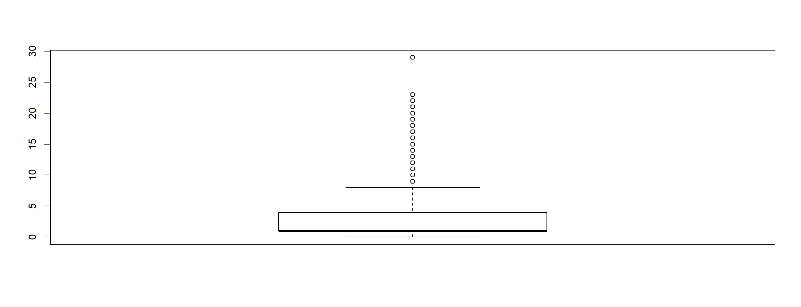
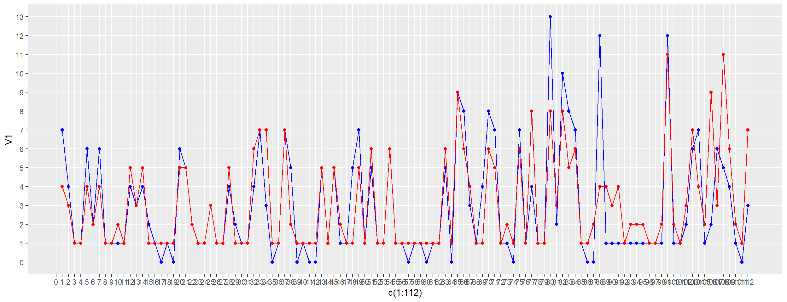

### 기상청 데이터를 활용한 전력소비량 예측

+ ####외기 데이터: 기상청 강남 삼성동 1시간 단위 외기 온도 데이터   
+ ####전력 데이터: 1시간 단위 전력데이터  

__________________________


##### 1. 패키지 붙이기


```r
library(dplyr);#데이터 전처리
library(tidyr);#피벗데이블 처리
library(ggplot2);#그래프그리기
#library(forecast);#시계열데이터예측(사용안함)
#library(tseries);#시계열분석(사용안함)
#library(zoo); #시계열데이터분석(사용안함)
#library(xts);#시계열데이터처리 
library(corrplot);#상관행렬,신뢰구간 그래프
library(gridExtra);#그래프분할하여그리기
library(urca);#데이터검정
library(caret);#데이터나누기,기계학습패키지
library(sjstats);#회귀모델요약
library(dummies) #더미페키지
library(keras);#케라스
library(e1071) #SVM패키지
library(nnet);#신경망패키지nnt
library(neuralnet); #신경망패키지nnt
library(NeuralNetTools); #신경망을 위한 시각화 및 분석 도구
```
__________________________
##### 2. 전력데이터 불러오기 및 처리


```r
rawdata = read.table(
    file="C:/RDATA/EANBEMSDATA.txt", 
    header=TRUE, 
    sep=",") #데이터 불러오기

rawdata1 <- select(rawdata, T_DATETIME, I_THISMONTH, C_DESC)
#날짜,SUM,종류추출

rawdata2 <- rawdata1 %>% filter(
     C_DESC == c("4층 - 메인")|
         C_DESC == c("6층 - 메인")|
         C_DESC == c("7층 - 메인")|
         C_DESC == c("8층 - 메인"))#행데이터 추출
   
rawdata3 <- mutate(
    rawdata2, T_DATETIME = substr(rawdata2$T_DATETIME, 1, 14)
    ) #시간 길이 변경

rawdata4 <- arrange(rawdata3, T_DATETIME)#순서변경

rawdata4 <- arrange(rawdata4, C_DESC)#순서변경

rawdata5 <-rawdata4 %>% filter(
    grepl(c(":00|:01|:02|:03|:04|:05"), T_DATETIME)
    )
#시간데이터 추출

df <- rawdata5 %>% mutate(
    diff = I_THISMONTH - lag(I_THISMONTH)
    ) # 계산

df1 <- df %>% filter(
    !(diff == 0 & grepl(c(":05"), T_DATETIME))
    )#data 정리

df2 <- df1 %>% mutate(
    diff = I_THISMONTH - lag(I_THISMONTH)
    ) # 계산

df3 <- df2 %>% filter(
    !(diff == 0 & grepl(c("18/09|:05"),  T_DATETIME))
    )#data 정리

df4 <- df3 %>% mutate(
    diff = I_THISMONTH - lag(I_THISMONTH)
    ) # 계산

df4$diff <- ifelse(df4$diff < 0 | df4$diff >30 ,NA, df4$diff)#이상치 처리

df5 <- df4 %>% fill(diff,.direction = "up")#NA값 처리 

df6 <- df5 %>% mutate(date = as.POSIXct(T_DATETIME),by = "hour")

boxplot(df5$diff) #극단 값 확인
```

<!-- -->

______________________________________________
##### 3. 기상청데이터 불러오기 및 처리 


```r
T_rawdata <- read.csv(
    file="C:/RDATA/기상청 데이터.csv", header=FALSE
    ) #데이터 불러오기

T_rawdata<- rename(T_rawdata, "temperature" = "V3" ) #컬럼이름변경

T_rawdata1 <- T_rawdata %>% filter(
    !grepl("Start| ", V1) & !grepl("Start", temperature)
    ) #특정데이터삭제

T_rawdata2 <- T_rawdata1 %>% mutate(
    date = seq(from = as.POSIXct("2018-09-01 00:00"),
               to = as.POSIXct("2019-01-31 23:00"), by = "hour")
    ) #시간생성

T_rawdata3 <- T_rawdata2 %>% mutate(date = substr(date, 3, 13)) #시간 길이 변경

E_rawdata <- df6 %>% mutate(date = substr(date, 3, 13)) #시간 길이 변경

andf <- merge(T_rawdata3, E_rawdata, by = "date", all.x = FALSE) #데이터 병합

andf1 <- select(andf,c(1,2,3,4,7,8)) #분석데이터 추출

andf1 <- na.omit(andf1) #NA값처리

andf2 <- andf1 %>%  mutate(week = as.Date(andf1$date)) 

andf2 <- andf2 %>% mutate(weekdays = weekdays(andf2$week)) #주일생성

andf3 <- andf2 %>% filter(
    !grepl("09-24|09-25|09-26|10-03|10-08|10-09|11-26|12-25|12-31|01-01", week)
    )#공휴일제외

#andf3 <- andf3 %>% filter(!grepl("토요일|일요일", weekdays))

andf4 <- andf3 %>% mutate(
    time = substr(date, 10, 11), month = substr(date, 4, 5)
    ) #시간설정

andf5 <- andf4 %>% select(temperature, diff, time, weekdays, C_DESC)#변수추출

andf6 <- cbind(andf5, dummy("C_DESC", andf5, sep = " ",drop = T))#더미변수만들기

andf6 <- cbind(andf6, dummy("time", andf5, sep = " ",drop = T))#변수추출

andf6 <- cbind(andf6, dummy("weekdays", andf5, sep = " ",drop = T))#변수추출

andf7 <- andf6 %>% select(-c(time,weekdays,C_DESC)) #변수추출

andf8 <- andf7 %>% mutate(
    temperature= as.numeric(as.character(temperature))
    )#캐릭터,뉴메릭변환 
```

____________________________
##### 4. 데이터 정리  


```r
normalize <- function (x) {
    normalized = (x - min(x)) / (max(x) - min(x))
    return(normalized)}#데이터정규화함수

andf9 <- andf8 %>% mutate(temperature = (normalize(andf8[,1]))) #데이터 정규화

#andf9 <- andf9 %>% mutate(diff = (normalize(andf8[,2]))) #데이터 라벨 정규화

andf10 <- select(andf9, diff, everything()) #데이터순서변경

andf10<- andf10%>% select(-c(3:14,28,29,30,31,32,33,34,37))#변수삭제
```

____________________________________
##### 5.데이터 분할


```r
ann <- createDataPartition(y=andf10$diff, p=0.99, list=FALSE) #데이터 분할

train <- andf10[ann,]#데이터 분할

train_x <- train %>% select(-c(diff)) #학습데이터

train_y <- train %>% select(c(diff)) #학습라벨

test <- andf10[-ann,]#데이터 분할

test_x <- test %>% select(-c(diff)) #예측데이터

test_y <- test %>% select(c(diff)) #예측라벨

train_x <- as.matrix(train_x); train_y <- as.matrix(train_y) #매트릭스구조

dimnames(train_x) <- NULL; dimnames(train_y) <- NULL #행렬

test_x <- as.matrix(test_x); test_y <- as.matrix(test_y)#매트릭스구조

dimnames(test_x) <- NULL; dimnames(test_y) <- NULL #행렬
```

_______________________________
##### 6.DNN  


```r
set.seed(0) #시드고정

model <- keras_model_sequential() #모델초기화 

#model %>% layer_lstm(units = 64, dropout = 0.25, recurrent_dropout = 0.25, return_sequences = FALSE)

model %>%
    layer_dense(units = 128, kernel_initializer='normal', activation = 'relu',
                input_shape = c(16)) %>% 
    layer_dropout(rate = 0.3) %>% 
    layer_dense(units = 128, kernel_initializer='normal', activation = 'relu') %>% 
    layer_dropout(rate = 0.3) %>% 
    layer_dense(units = 1, kernel_initializer='normal', activation = 'relu') # 모형에 계층 추가


model %>% compile(
    optimizer = "Adam", #optimizer_sgd(lr=0.01, momentum=0.5, decay=0.005), #Stochastic Gradient Descent 경사하강법
    loss = 'mean_squared_error', # mean_absolute_error 평균절대오차 예측과 타깃거리 절대값 
    metrics = 'mean_absolute_error'
    ) #모델컴파일

early_stopping <- callback_early_stopping(
    monitor = "val_loss", min_delta = 0, patience = 10, verbose = 1, mode = "min"
    ) #조기종료

history <- model %>% fit(
    train_x, train_y, 
    epochs = 100,
    batch_size = 100,
    callbacks = early_stopping, 
    #shuffle=T,
    validation_split = 0.2) # fit
```

____________________________
##### 7. 학습결과


```r
test_y1<- predict(model,test_x) #평균 제곱근 편차
model %>% evaluate(test_x, test_y) # 정확도
```

```
## $loss
## [1] 4.307076
## 
## $mean_absolute_error
## [1] 1.255815
```

___________________________________
##### 8. 예측값 처리 및 결과분석  


```r
test_y1 <- round(test_y1) #반옿림

compare <- as.data.frame(cbind(test_y, test_y1))

error <- compare$V1 - compare$V2

sum(error)
```

```
## [1] 22
```

```r
sum(compare$V1)
```

```
## [1] 338
```

```r
sum(compare$V2)
```

```
## [1] 316
```

```r
rmse<-  sqrt(mean(error^2))#RMSE

sqrt(mean(error^2))#RMSE
```

```
## [1] 2.087377
```

```r
rmse/mean(compare$V2) #CV변동계수
```

```
## [1] 0.7398298
```

_______________________
#####9.예측그래프


```r
ggplot(data=compare, aes(x=c(1:112)))+
    geom_line(aes(y = V1), colour= "blue")+
    geom_point(aes(y = V1), colour= "blue")+
    geom_line(aes(y = V2), colour = "red")+
    geom_point(aes(y = V2), colour = "red")+
    scale_y_continuous(breaks=seq(0, 13, 1))+
    scale_x_continuous(breaks=seq(0, 112, 1))+
    theme(panel.grid = element_blank())+
    theme(panel.grid.major = element_line(color = "white"))
```

<!-- -->

